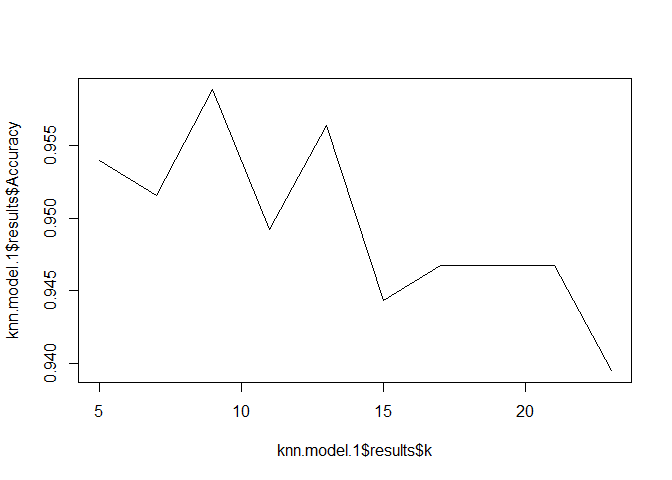
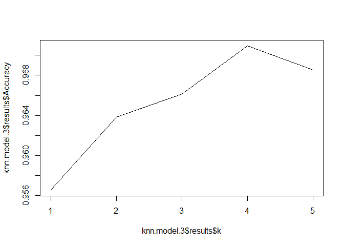

Demonstration Class 5: Regularized Regression, K-Nearest Neighbors and
Naive Bayes
================
Lectured by JAS
2/14/2023

# Demonstration of Regularization Methods

This will be a demonstration of the three regularization methods
discussed: ridge regression, Lasso (least absolute shrinkage and
selection operator) and Elastic Net.

## Description of Data

The data we will be using are from the 2019 County Health Rankings. They
provide data on a number of demographic, social, environmental and
health characteristics on counties within the United States. *We will be
using this dataset to try to identify the most important predictors of
life expectancy on a county-level.* We have restricted the dataset to 67
features and an outcome of life expectancy in years.

Original data upon which this exercise has been based can be found here:
<http://www.countyhealthrankings.org/explore-health-rankings/rankings-data-documentation>

Variable names are not originally informative. You can look up all full
variable name meanings here:
<http://www.countyhealthrankings.org/sites/default/files/2019%20Analytic%20Documentation_1.pdf>

### Load needed libraries

``` r
library(tidyverse) 
```

    ## ── Attaching packages ─────────────────────────────────────── tidyverse 1.3.2 ──
    ## ✔ ggplot2 3.4.1      ✔ purrr   0.3.5 
    ## ✔ tibble  3.1.8      ✔ dplyr   1.0.10
    ## ✔ tidyr   1.2.1      ✔ stringr 1.5.0 
    ## ✔ readr   2.1.3      ✔ forcats 0.5.2

    ## Warning: package 'ggplot2' was built under R version 4.2.2

    ## Warning: package 'readr' was built under R version 4.2.2

    ## Warning: package 'purrr' was built under R version 4.2.2

    ## Warning: package 'dplyr' was built under R version 4.2.2

    ## Warning: package 'stringr' was built under R version 4.2.2

    ## ── Conflicts ────────────────────────────────────────── tidyverse_conflicts() ──
    ## ✖ dplyr::filter() masks stats::filter()
    ## ✖ dplyr::lag()    masks stats::lag()

``` r
library(caret) 
```

    ## Warning: package 'caret' was built under R version 4.2.2

    ## Loading required package: lattice
    ## 
    ## Attaching package: 'caret'
    ## 
    ## The following object is masked from 'package:purrr':
    ## 
    ##     lift

``` r
library(glmnet) # Regularized Regression
```

    ## Warning: package 'glmnet' was built under R version 4.2.2

    ## Loading required package: Matrix

    ## Warning: package 'Matrix' was built under R version 4.2.2

    ## 
    ## Attaching package: 'Matrix'
    ## 
    ## The following objects are masked from 'package:tidyr':
    ## 
    ##     expand, pack, unpack
    ## 
    ## Loaded glmnet 4.1-6

``` r
library(klaR) # Naive Bayes
```

    ## Warning: package 'klaR' was built under R version 4.2.2

    ## Loading required package: MASS

    ## Warning: package 'MASS' was built under R version 4.2.2

    ## 
    ## Attaching package: 'MASS'
    ## 
    ## The following object is masked from 'package:dplyr':
    ## 
    ##     select

### Step 1: Read in data, partition, and put features into separate object

When using CreateDataPartition, note that for numeric y, the sample is
split into groups sections based on percentiles and sampling is done
within these subgroups. This helps training and testing to be similar.
Default number of quantiles is 5.

We are partitioning the data in a 70/30 split.

``` r
set.seed(100)

chr = read.csv("./Data/chr.csv")

# Strip off ID Variable because it is meaningless
chr = chr[, 2:68]

# Add informative feature names
var.names = 
  c("pre_death", "poorhealth", "poorphyshealth_days", "poormenthealth_days", "low_bwt", "ad_smoking", "ad_obesity", "foodenv_index", "phys_inactivity", "exer_access", "excess_drink", "alc_drivdeaths", "sti", "teen_birth", "uninsured", "primcareproviders", "dentists", "menthealthproviders", "prevhosp", "mammo_screen", "flu_vacc", "hsgrad", "somecollege", "unemployed", "child_poverty", "income_ineq", "sing_parent", "social_assoc", "violent_crime", "injury_deaths", "pm_air", "water_viol", "housing_prob", "driving_alone", "long_commute", "life_exp", "age_adj_premortality", "freq_physdistress", "freq_mentdistress", "diabetes", "hiv", "food_insecure", "ltd_access_healthyfood", "mvcrash_deaths", "insuff_sleep", "uninsured_adults", "uninsured_child", "other_pcp", "medhhinc", "freelunch_child", "res_seg_bw", "res_seg_nw", "firearm_fatalities", "homeownership", "hous_cost_burden", "population", "bw18", "gte65", "nonhisp_afam", "AmerInd_AlasNative", "Asian", "OPacIslander", "Hisp", "nonhisp_white", "nonprof_english", "female", "rural")

colnames(chr) = var.names

#tidyverse way to create data partition
#training.data<-chr$life_exp %>% createDataPartition(p = 0.7, list = F)

train.indices = createDataPartition(y = chr$life_exp, p = 0.7,list = FALSE)
train.data = chr[train.indices, ]
test.data = chr[-train.indices, ]
```

### Step 2: Running the algorithms on the training data

I will demonstrate regularized regression using the caret package. Note,
it is the `glmnet` package that we will call to within caret. This
package allows us to run all three of the penalized models using the
same format. The value of the **alpha parameter** dictates whether it is
a *ridge regression*, *lasso* or *elastic net*. A value of 0 is the
ridge regression, the 1 is a lasso and any value in between 0 and 1 will
provide an elastic net.

By default, `caret` will vary both alpha and lambda to select the best
values via cross-validation. Because the alpha is not set at 0 or 1,
this can (and often does) result in an elastic net. But, you can set the
alpha level at a fixed value in order to obtain ridge or lasso results.

`tuneLength` sets the number of combinations of different values of
alpha and lambda to compare. For example, setting `tunelength` to 10
will result in 10 values of alpha and 10 values of lambda

This is an example of Elastic Net model:

``` r
set.seed(123)

en.model =  train(
  life_exp ~ ., data = train.data, method = "glmnet", trControl = trainControl("cv", number = 10), preProc = c("center", "scale"), tuneLength = 10)

# Print the values of alpha and lambda that gave best prediction
en.model$bestTune
```

    ##    alpha     lambda
    ## 55   0.6 0.03644534

``` r
# Print all of the options examined
en.model$results
```

    ##     alpha      lambda      RMSE  Rsquared       MAE    RMSESD RsquaredSD
    ## 1     0.1 0.001279666 0.9928499 0.8892506 0.5585560 0.1932511 0.03460226
    ## 2     0.1 0.002956194 0.9927684 0.8892739 0.5584954 0.1932070 0.03457897
    ## 3     0.1 0.006829191 0.9923001 0.8894012 0.5579635 0.1933353 0.03448504
    ## 4     0.1 0.015776316 0.9902532 0.8898153 0.5564404 0.1952903 0.03463959
    ## 5     0.1 0.036445337 0.9867300 0.8904485 0.5527721 0.2002353 0.03525438
    ## 6     0.1 0.084193455 0.9817545 0.8914752 0.5496360 0.2069650 0.03588305
    ## 7     0.1 0.194497802 0.9863792 0.8907867 0.5546968 0.2161281 0.03703163
    ## 8     0.1 0.449315148 1.0186939 0.8856486 0.5849671 0.2280215 0.03949175
    ## 9     0.1 1.037976268 1.1084165 0.8728589 0.6617052 0.2375589 0.04372544
    ## 10    0.1 2.397859806 1.3118739 0.8463424 0.8414637 0.2337133 0.05153056
    ## 11    0.2 0.001279666 0.9929659 0.8892040 0.5586927 0.1936585 0.03473094
    ## 12    0.2 0.002956194 0.9923100 0.8894090 0.5579257 0.1932048 0.03449066
    ## 13    0.2 0.006829191 0.9913198 0.8896275 0.5569880 0.1938153 0.03448302
    ## 14    0.2 0.015776316 0.9883802 0.8901718 0.5537711 0.1971386 0.03490403
    ## 15    0.2 0.036445337 0.9826043 0.8913387 0.5481599 0.2025207 0.03545794
    ## 16    0.2 0.084193455 0.9779726 0.8923884 0.5435239 0.2094042 0.03609362
    ## 17    0.2 0.194497802 0.9865411 0.8911748 0.5510156 0.2185570 0.03749432
    ## 18    0.2 0.449315148 1.0308931 0.8849583 0.5878684 0.2294389 0.04036505
    ## 19    0.2 1.037976268 1.1478924 0.8729100 0.6895516 0.2365535 0.04585222
    ## 20    0.2 2.397859806 1.4389688 0.8523279 0.9594189 0.2149444 0.05211204
    ## 21    0.3 0.001279666 0.9920155 0.8894552 0.5590230 0.1931085 0.03449521
    ## 22    0.3 0.002956194 0.9921437 0.8894481 0.5577839 0.1931884 0.03446628
    ## 23    0.3 0.006829191 0.9905686 0.8897799 0.5559729 0.1942854 0.03453481
    ## 24    0.3 0.015776316 0.9864674 0.8905786 0.5512295 0.1984251 0.03504863
    ## 25    0.3 0.036445337 0.9794110 0.8920630 0.5444109 0.2037515 0.03551088
    ## 26    0.3 0.084193455 0.9772483 0.8926563 0.5403288 0.2106562 0.03626624
    ## 27    0.3 0.194497802 0.9932613 0.8901425 0.5534000 0.2196191 0.03788580
    ## 28    0.3 0.449315148 1.0461027 0.8836057 0.5944773 0.2314172 0.04158567
    ## 29    0.3 1.037976268 1.1920629 0.8727877 0.7308250 0.2312683 0.04695594
    ## 30    0.3 2.397859806 1.5697971 0.8631818 1.0858566 0.1965156 0.04898182
    ## 31    0.4 0.001279666 0.9919756 0.8894838 0.5584957 0.1931303 0.03447186
    ## 32    0.4 0.002956194 0.9919621 0.8894947 0.5573996 0.1930931 0.03442414
    ## 33    0.4 0.006829191 0.9898714 0.8899120 0.5548572 0.1951623 0.03467237
    ## 34    0.4 0.015776316 0.9847924 0.8909523 0.5491062 0.1993723 0.03514162
    ## 35    0.4 0.036445337 0.9776755 0.8924759 0.5415377 0.2048253 0.03558839
    ## 36    0.4 0.084193455 0.9781293 0.8925795 0.5389819 0.2110436 0.03638451
    ## 37    0.4 0.194497802 1.0029407 0.8884485 0.5587684 0.2192909 0.03821094
    ## 38    0.4 0.449315148 1.0606770 0.8823705 0.6045461 0.2320989 0.04240937
    ## 39    0.4 1.037976268 1.2399107 0.8712520 0.7756364 0.2255383 0.04797501
    ## 40    0.4 2.397859806 1.7132504 0.8663363 1.2203310 0.1834928 0.04698847
    ## 41    0.5 0.001279666 0.9924782 0.8893801 0.5582970 0.1933429 0.03445257
    ## 42    0.5 0.002956194 0.9915673 0.8895995 0.5569914 0.1931331 0.03436647
    ## 43    0.5 0.006829191 0.9889761 0.8900967 0.5536931 0.1957268 0.03473605
    ## 44    0.5 0.015776316 0.9828549 0.8913739 0.5470662 0.2002030 0.03519517
    ## 45    0.5 0.036445337 0.9764001 0.8927959 0.5393743 0.2054011 0.03561032
    ## 46    0.5 0.084193455 0.9806951 0.8921199 0.5396980 0.2111882 0.03645497
    ## 47    0.5 0.194497802 1.0098194 0.8873272 0.5607355 0.2211692 0.03889735
    ## 48    0.5 0.449315148 1.0746718 0.8814731 0.6160990 0.2309901 0.04273384
    ## 49    0.5 1.037976268 1.2888247 0.8694140 0.8233913 0.2148599 0.04622280
    ## 50    0.5 2.397859806 1.8500102 0.8637494 1.3413882 0.1755059 0.04553962
    ## 51    0.6 0.001279666 0.9920302 0.8894794 0.5580811 0.1931218 0.03444507
    ## 52    0.6 0.002956194 0.9911330 0.8896998 0.5565904 0.1932723 0.03436594
    ## 53    0.6 0.006829191 0.9882021 0.8902632 0.5526149 0.1962393 0.03479051
    ## 54    0.6 0.015776316 0.9815069 0.8916784 0.5452504 0.2006329 0.03520611
    ## 55    0.6 0.036445337 0.9762954 0.8928564 0.5383399 0.2059129 0.03565456
    ## 56    0.6 0.084193455 0.9842132 0.8914707 0.5416589 0.2107597 0.03643133
    ## 57    0.6 0.194497802 1.0156321 0.8863868 0.5618814 0.2232238 0.03963853
    ## 58    0.6 0.449315148 1.0908256 0.8800288 0.6302526 0.2306027 0.04329749
    ## 59    0.6 1.037976268 1.3355333 0.8679677 0.8702874 0.2074045 0.04507826
    ## 60    0.6 2.397859806 1.9817435 0.8653926 1.4545175 0.1712091 0.04503221
    ## 61    0.7 0.001279666 0.9920426 0.8894791 0.5578249 0.1931585 0.03444436
    ## 62    0.7 0.002956194 0.9911210 0.8896914 0.5562151 0.1934586 0.03442569
    ## 63    0.7 0.006829191 0.9874869 0.8904173 0.5516216 0.1967957 0.03484894
    ## 64    0.7 0.015776316 0.9805119 0.8919081 0.5438237 0.2010910 0.03522482
    ## 65    0.7 0.036445337 0.9769652 0.8927445 0.5375916 0.2059964 0.03568921
    ## 66    0.7 0.084193455 0.9878862 0.8907392 0.5436184 0.2111286 0.03659411
    ## 67    0.7 0.194497802 1.0214044 0.8855095 0.5638172 0.2234847 0.03991951
    ## 68    0.7 0.449315148 1.1104140 0.8776077 0.6482077 0.2294195 0.04388438
    ## 69    0.7 1.037976268 1.3785689 0.8674542 0.9135143 0.2024565 0.04428659
    ## 70    0.7 2.397859806 2.1271805 0.8678641 1.5773847 0.1680906 0.04411063
    ## 71    0.8 0.001279666 0.9920809 0.8894732 0.5576420 0.1931365 0.03442993
    ## 72    0.8 0.002956194 0.9910170 0.8896944 0.5557109 0.1939190 0.03452123
    ## 73    0.8 0.006829191 0.9866846 0.8905903 0.5506535 0.1972890 0.03490394
    ## 74    0.8 0.015776316 0.9797653 0.8920812 0.5426698 0.2015677 0.03524960
    ## 75    0.8 0.036445337 0.9778041 0.8925969 0.5371996 0.2057680 0.03567383
    ## 76    0.8 0.084193455 0.9916262 0.8899828 0.5448759 0.2115982 0.03680406
    ## 77    0.8 0.194497802 1.0269977 0.8846615 0.5671141 0.2226544 0.03993243
    ## 78    0.8 0.449315148 1.1313575 0.8746186 0.6676734 0.2252174 0.04373789
    ## 79    0.8 1.037976268 1.4166833 0.8693070 0.9508920 0.1985253 0.04342309
    ## 80    0.8 2.397859806 2.2877921 0.8708678 1.7111439 0.1665333 0.04217561
    ## 81    0.9 0.001279666 0.9919915 0.8894935 0.5574121 0.1930611 0.03440939
    ## 82    0.9 0.002956194 0.9906053 0.8897808 0.5552102 0.1941616 0.03454661
    ## 83    0.9 0.006829191 0.9858148 0.8907827 0.5496394 0.1976206 0.03492666
    ## 84    0.9 0.015776316 0.9789428 0.8922712 0.5416006 0.2020401 0.03526706
    ## 85    0.9 0.036445337 0.9789854 0.8923678 0.5372560 0.2055219 0.03566040
    ## 86    0.9 0.084193455 0.9951476 0.8892773 0.5460442 0.2116515 0.03697470
    ## 87    0.9 0.194497802 1.0337377 0.8835618 0.5721739 0.2210132 0.03979258
    ## 88    0.9 0.449315148 1.1495168 0.8720227 0.6847886 0.2181937 0.04208593
    ## 89    0.9 1.037976268 1.4561934 0.8711294 0.9886654 0.1943804 0.04186175
    ## 90    0.9 2.397859806 2.4523537 0.8709848 1.8468581 0.1675158 0.04044640
    ## 91    1.0 0.001279666 0.9920716 0.8894748 0.5573207 0.1930561 0.03439832
    ## 92    1.0 0.002956194 0.9902267 0.8898567 0.5547351 0.1944453 0.03457881
    ## 93    1.0 0.006829191 0.9849640 0.8909645 0.5487374 0.1980433 0.03496239
    ## 94    1.0 0.015776316 0.9782202 0.8924455 0.5407123 0.2022502 0.03525197
    ## 95    1.0 0.036445337 0.9805562 0.8920513 0.5378268 0.2052251 0.03563094
    ## 96    1.0 0.084193455 0.9987988 0.8885374 0.5478308 0.2113330 0.03705835
    ## 97    1.0 0.194497802 1.0430623 0.8817656 0.5800885 0.2184871 0.03957202
    ## 98    1.0 0.449315148 1.1600757 0.8707511 0.6950255 0.2123888 0.04046938
    ## 99    1.0 1.037976268 1.4921989 0.8709848 1.0217791 0.1917903 0.04044640
    ## 100   1.0 2.397859806 2.6286082 0.8709848 1.9915163 0.1689824 0.04044640
    ##          MAESD
    ## 1   0.05655886
    ## 2   0.05648406
    ## 3   0.05605109
    ## 4   0.05666332
    ## 5   0.05855175
    ## 6   0.06062565
    ## 7   0.06278898
    ## 8   0.06765024
    ## 9   0.07791888
    ## 10  0.08984550
    ## 11  0.05684632
    ## 12  0.05593377
    ## 13  0.05572059
    ## 14  0.05702031
    ## 15  0.05799296
    ## 16  0.05811715
    ## 17  0.06101330
    ## 18  0.06528977
    ## 19  0.07612843
    ## 20  0.08078441
    ## 21  0.05556914
    ## 22  0.05531345
    ## 23  0.05573103
    ## 24  0.05676356
    ## 25  0.05660679
    ## 26  0.05655237
    ## 27  0.05989690
    ## 28  0.06490689
    ## 29  0.07272813
    ## 30  0.07138321
    ## 31  0.05531636
    ## 32  0.05508829
    ## 33  0.05583326
    ## 34  0.05623694
    ## 35  0.05554440
    ## 36  0.05595544
    ## 37  0.05847023
    ## 38  0.06543510
    ## 39  0.06944315
    ## 40  0.06963719
    ## 41  0.05523696
    ## 42  0.05517938
    ## 43  0.05576497
    ## 44  0.05566892
    ## 45  0.05420828
    ## 46  0.05547186
    ## 47  0.05819222
    ## 48  0.06529797
    ## 49  0.06507825
    ## 50  0.06742368
    ## 51  0.05499432
    ## 52  0.05502440
    ## 53  0.05563704
    ## 54  0.05494522
    ## 55  0.05354221
    ## 56  0.05489531
    ## 57  0.05899020
    ## 58  0.06553328
    ## 59  0.06212101
    ## 60  0.06841483
    ## 61  0.05483975
    ## 62  0.05509988
    ## 63  0.05549049
    ## 64  0.05443068
    ## 65  0.05310229
    ## 66  0.05456270
    ## 67  0.05904866
    ## 68  0.06505206
    ## 69  0.06162484
    ## 70  0.06967715
    ## 71  0.05478575
    ## 72  0.05533850
    ## 73  0.05534370
    ## 74  0.05403386
    ## 75  0.05264211
    ## 76  0.05458029
    ## 77  0.05885995
    ## 78  0.06309172
    ## 79  0.06195118
    ## 80  0.07152722
    ## 81  0.05471596
    ## 82  0.05525462
    ## 83  0.05505766
    ## 84  0.05360267
    ## 85  0.05237280
    ## 86  0.05431289
    ## 87  0.05772753
    ## 88  0.06117563
    ## 89  0.06331189
    ## 90  0.07416093
    ## 91  0.05475679
    ## 92  0.05523827
    ## 93  0.05473546
    ## 94  0.05299561
    ## 95  0.05223588
    ## 96  0.05380668
    ## 97  0.05627130
    ## 98  0.05966239
    ## 99  0.06509976
    ## 100 0.07677982

``` r
# Model coefficients
## Caret will save the best tuned values as its 'Final Model'
## But we also need to put in the best tuned lambda value.
coef(en.model$finalModel, en.model$bestTune$lambda)
```

    ## 67 x 1 sparse Matrix of class "dgCMatrix"
    ##                                  s1
    ## (Intercept)            77.481544157
    ## pre_death              -0.697206492
    ## poorhealth              .          
    ## poorphyshealth_days     .          
    ## poormenthealth_days     .          
    ## low_bwt                 0.033109853
    ## ad_smoking              .          
    ## ad_obesity             -0.051226179
    ## foodenv_index           .          
    ## phys_inactivity        -0.013703915
    ## exer_access             .          
    ## excess_drink            .          
    ## alc_drivdeaths          .          
    ## sti                     .          
    ## teen_birth              .          
    ## uninsured               .          
    ## primcareproviders       .          
    ## dentists                .          
    ## menthealthproviders    -0.033417762
    ## prevhosp                .          
    ## mammo_screen           -0.001945728
    ## flu_vacc               -0.003885211
    ## hsgrad                  .          
    ## somecollege             .          
    ## unemployed              .          
    ## child_poverty           .          
    ## income_ineq             0.034543685
    ## sing_parent             .          
    ## social_assoc            .          
    ## violent_crime          -0.006413354
    ## injury_deaths          -0.059856203
    ## pm_air                 -0.188843660
    ## water_viol              .          
    ## housing_prob            .          
    ## driving_alone          -0.165723331
    ## long_commute           -0.017057635
    ## age_adj_premortality   -1.829000368
    ## freq_physdistress       .          
    ## freq_mentdistress       .          
    ## diabetes                .          
    ## hiv                     .          
    ## food_insecure           .          
    ## ltd_access_healthyfood  0.071049925
    ## mvcrash_deaths          .          
    ## insuff_sleep           -0.034310493
    ## uninsured_adults        .          
    ## uninsured_child         0.037099171
    ## other_pcp               0.004124092
    ## medhhinc                0.149007658
    ## freelunch_child         .          
    ## res_seg_bw              .          
    ## res_seg_nw              .          
    ## firearm_fatalities      .          
    ## homeownership           .          
    ## hous_cost_burden        .          
    ## population              .          
    ## bw18                   -0.156729382
    ## gte65                   0.080784246
    ## nonhisp_afam            .          
    ## AmerInd_AlasNative      .          
    ## Asian                   0.102383187
    ## OPacIslander           -0.043091611
    ## Hisp                    .          
    ## nonhisp_white          -0.120186133
    ## nonprof_english         0.086534200
    ## female                  .          
    ## rural                   0.062841886

``` r
# All the coefficients are scaled, so we can view these coefficients as a measure of variable importance.

# Make predictions in test set
en.pred = en.model %>% predict(test.data)

# Estimate prediction performance
# Option 1
postResample(en.pred, test.data$life_exp)
```

    ##      RMSE  Rsquared       MAE 
    ## 1.1036062 0.8605858 0.5608313

``` r
# Option 2
data.frame(
  RMSE = RMSE(en.pred, test.data$life_exp),
  Rsquare = R2(en.pred, test.data$life_exp))
```

    ##       RMSE   Rsquare
    ## 1 1.103606 0.8605858

The following code will allow you to fix the alpha (I have it set to 0
for a ridge) and run either a *ridge* or *lasso* analysis. It also
creates a sequence of lambda values that you set yourself to use for
tuning.

If the `caret` package will select the optimal alpha and lambda value,
why might you still choose lasso or ridge over elastic net (or an
automated process of choosing alpha as in caret)?

#### Exercise:

Using the code below as a start, tune both a ridge and lasso model.
Compare evaluation metrics in the test set to what you obtained above
from the elastic net.

``` r
# Create grid to search lambda
lambda = 10^seq(-3, 3, length = 100)

set.seed(100)

# Note replacing `tuneLength` with `tuneGrid`
model.4 = train(
  life_exp ~ ., data = train.data, method = "glmnet", trControl = trainControl("cv", number = 10), preProc = c("center", "scale"), tuneGrid = expand.grid(alpha = 0, lambda = lambda))

model.4$bestTune
```

    ##    alpha    lambda
    ## 41     0 0.2656088

## Demonstration of K Nearest Neighbors

Using the caret package to implement KNN.

------------------------------------------------------------------------

Data Description:

Data come from the UCI Machine Learning Repository. This is a dataset
containing clinical information about individuals who are either blood
donors (i.e. healthy controls) or have varying severity of liver
disease.

Data Set Information:

The target attribute for classification is Category (blood donors
vs. Hepatitis C (including its progress (‘just’ Hepatitis C, Fibrosis,
Cirrhosis).

Attribute Information:

All attributes except Category and Sex are numerical. The laboratory
data are the attributes 5-14. 1) X (Patient ID/No.) 2) Category
(diagnosis) (values: ‘0=Blood Donor’, ‘0s=suspect Blood Donor’,
‘1=Hepatitis’, ‘2=Fibrosis’, ‘3=Cirrhosis’) 3) Age (in years) 4) Sex
(f,m) 5) ALB 6) ALP 7) ALT 8) AST 9) BIL 10) CHE 11) CHOL 12) CREA 13)
GGT 14) PROT

------------------------------------------------------------------------

### Cleaning and partitioning data

Because **KNN** is distance-based, we are going to restrict to only
numerical (continuous) features. We will drop ID and Sex assignment. We
will also collapse the outcome classification into a binary (Liver
Disease, No Evidence of Disease). We are also excluding individuals with
missing data.

``` r
set.seed(111)
hcvdat0 = read.csv("./Data/hcvdat0.csv")

#Look at features
str(hcvdat0)
```

    ## 'data.frame':    615 obs. of  14 variables:
    ##  $ X       : int  1 2 3 4 5 6 7 8 9 10 ...
    ##  $ Category: chr  "0=Blood Donor" "0=Blood Donor" "0=Blood Donor" "0=Blood Donor" ...
    ##  $ Age     : int  32 32 32 32 32 32 32 32 32 32 ...
    ##  $ Sex     : chr  "m" "m" "m" "m" ...
    ##  $ ALB     : num  38.5 38.5 46.9 43.2 39.2 41.6 46.3 42.2 50.9 42.4 ...
    ##  $ ALP     : num  52.5 70.3 74.7 52 74.1 43.3 41.3 41.9 65.5 86.3 ...
    ##  $ ALT     : num  7.7 18 36.2 30.6 32.6 18.5 17.5 35.8 23.2 20.3 ...
    ##  $ AST     : num  22.1 24.7 52.6 22.6 24.8 19.7 17.8 31.1 21.2 20 ...
    ##  $ BIL     : num  7.5 3.9 6.1 18.9 9.6 12.3 8.5 16.1 6.9 35.2 ...
    ##  $ CHE     : num  6.93 11.17 8.84 7.33 9.15 ...
    ##  $ CHOL    : num  3.23 4.8 5.2 4.74 4.32 6.05 4.79 4.6 4.1 4.45 ...
    ##  $ CREA    : num  106 74 86 80 76 111 70 109 83 81 ...
    ##  $ GGT     : num  12.1 15.6 33.2 33.8 29.9 91 16.9 21.5 13.7 15.9 ...
    ##  $ PROT    : num  69 76.5 79.3 75.7 68.7 74 74.5 67.1 71.3 69.9 ...

``` r
#drop ID and sex variables
hcvdat0$X<-NULL
hcvdat0$Sex<-NULL


#Make outcome category a factor var
hcvdat0$Category<-as.factor(hcvdat0$Category)

#Collapse factor levels of outcome variable
hcvdat0$outcome.class<-fct_collapse(hcvdat0$Category, NED=c("0=Blood Donor","0s=suspect Blood Donor"), LiverDisease=c("1=Hepatitis", "2=Fibrosis", "3=Cirrhosis"))

#Drop category 
hcvdat0$Category<-NULL

#Check distributions, missing data etc.
summary(hcvdat0)
```

    ##       Age             ALB             ALP              ALT        
    ##  Min.   :19.00   Min.   :14.90   Min.   : 11.30   Min.   :  0.90  
    ##  1st Qu.:39.00   1st Qu.:38.80   1st Qu.: 52.50   1st Qu.: 16.40  
    ##  Median :47.00   Median :41.95   Median : 66.20   Median : 23.00  
    ##  Mean   :47.41   Mean   :41.62   Mean   : 68.28   Mean   : 28.45  
    ##  3rd Qu.:54.00   3rd Qu.:45.20   3rd Qu.: 80.10   3rd Qu.: 33.08  
    ##  Max.   :77.00   Max.   :82.20   Max.   :416.60   Max.   :325.30  
    ##                  NA's   :1       NA's   :18       NA's   :1       
    ##       AST              BIL             CHE              CHOL      
    ##  Min.   : 10.60   Min.   :  0.8   Min.   : 1.420   Min.   :1.430  
    ##  1st Qu.: 21.60   1st Qu.:  5.3   1st Qu.: 6.935   1st Qu.:4.610  
    ##  Median : 25.90   Median :  7.3   Median : 8.260   Median :5.300  
    ##  Mean   : 34.79   Mean   : 11.4   Mean   : 8.197   Mean   :5.368  
    ##  3rd Qu.: 32.90   3rd Qu.: 11.2   3rd Qu.: 9.590   3rd Qu.:6.060  
    ##  Max.   :324.00   Max.   :254.0   Max.   :16.410   Max.   :9.670  
    ##                                                    NA's   :10     
    ##       CREA              GGT              PROT            outcome.class
    ##  Min.   :   8.00   Min.   :  4.50   Min.   :44.80   NED         :540  
    ##  1st Qu.:  67.00   1st Qu.: 15.70   1st Qu.:69.30   LiverDisease: 75  
    ##  Median :  77.00   Median : 23.30   Median :72.20                     
    ##  Mean   :  81.29   Mean   : 39.53   Mean   :72.04                     
    ##  3rd Qu.:  88.00   3rd Qu.: 40.20   3rd Qu.:75.40                     
    ##  Max.   :1079.10   Max.   :650.90   Max.   :90.00                     
    ##                                     NA's   :1

``` r
#Omit those with missing data
hcvdata<-na.omit(hcvdat0)

#Split data 70/30
train.indices<-hcvdata$outcome.class %>% createDataPartition(p = 0.7, list = F)

train.data<-hcvdata[train.indices, ]
test.data<-hcvdata[-train.indices, ]
```

### Train and assess performance of model

We will use 10-fold cross validation to compare 10 different values of
k. We will also use under-sampling due to the imbalance of the data.

``` r
set.seed(111)

# Set control options..using 10-fold cross-validation and using under-sampling due to unbalanced data
trnctrl = trainControl(method = "cv", number = 10, sampling = "down")

knn.model.1 = train(outcome.class ~ ., data = train.data, method = "knn", trControl = trnctrl, preProcess = c("center", "scale"), tuneLength = 10)

# Identify optimal number of k
knn.model.1$bestTune
```

    ##   k
    ## 3 9

``` r
# See full set of results
knn.model.1$results
```

    ##     k  Accuracy     Kappa AccuracySD   KappaSD
    ## 1   5 0.9539489 0.7468871 0.04218838 0.2073084
    ## 2   7 0.9515679 0.7118691 0.03440730 0.2247288
    ## 3   9 0.9588269 0.7180674 0.01661002 0.1493885
    ## 4  11 0.9491870 0.6356270 0.02119650 0.1842214
    ## 5  13 0.9563879 0.6770427 0.01563385 0.1420630
    ## 6  15 0.9443089 0.5760348 0.02591202 0.2523991
    ## 7  17 0.9467480 0.5945698 0.02244959 0.1906481
    ## 8  19 0.9467480 0.5815427 0.02244959 0.2450064
    ## 9  21 0.9467480 0.5815427 0.02244959 0.2450064
    ## 10 23 0.9394890 0.5193379 0.02635414 0.2569750

``` r
plot(knn.model.1$results$k, knn.model.1$results$Accuracy, type = "l")
```

<!-- -->

``` r
# REPEAT using over-sampling due to unbalanced data
set.seed(112)

trnctrl = trainControl(method = "cv", number = 10, sampling = "up")

knn.model.2 = train(outcome.class ~ .  , data = train.data, method = "knn", trControl = trnctrl, preProcess = c("center", "scale"), tuneLength = 10)

knn.model.2$bestTune
```

    ##   k
    ## 1 5

Instead of having the computer to choose the values of *k* for us, we
can also set our k-values using the `expand.grid` function.

``` r
# Create a vector that has a sequence of 1:5 by 1
k.vec = seq(1, 5, 1)

knn.model.3 = train(outcome.class ~ .  , data = train.data, method = "knn", trControl = trnctrl, preProcess = c("center", "scale"), tuneGrid = expand.grid(k = k.vec))

# Identify optimal number of k
knn.model.3$bestTune
```

    ##   k
    ## 4 4

``` r
# See full set of results
knn.model.3$results
```

    ##   k  Accuracy     Kappa AccuracySD    KappaSD
    ## 1 1 0.9565621 0.6482808 0.03549293 0.33123761
    ## 2 2 0.9638211 0.7336332 0.02828431 0.23636793
    ## 3 3 0.9661440 0.7854654 0.02610306 0.16328913
    ## 4 4 0.9709059 0.8349228 0.02522915 0.12639532
    ## 5 5 0.9685250 0.8251175 0.02017588 0.09992736

``` r
plot(knn.model.3$results$k, knn.model.3$results$Accuracy, type = "l")
```

<!-- -->

### Make predictions in test-set using better model

``` r
model.results.3 = predict(knn.model.3, newdata = test.data)
confusionMatrix(model.results.3, test.data$outcome.class, positive = "LiverDisease")
```

    ## Confusion Matrix and Statistics
    ## 
    ##               Reference
    ## Prediction     NED LiverDisease
    ##   NED          154            5
    ##   LiverDisease   5           11
    ##                                           
    ##                Accuracy : 0.9429          
    ##                  95% CI : (0.8974, 0.9723)
    ##     No Information Rate : 0.9086          
    ##     P-Value [Acc > NIR] : 0.06793         
    ##                                           
    ##                   Kappa : 0.6561          
    ##                                           
    ##  Mcnemar's Test P-Value : 1.00000         
    ##                                           
    ##             Sensitivity : 0.68750         
    ##             Specificity : 0.96855         
    ##          Pos Pred Value : 0.68750         
    ##          Neg Pred Value : 0.96855         
    ##              Prevalence : 0.09143         
    ##          Detection Rate : 0.06286         
    ##    Detection Prevalence : 0.09143         
    ##       Balanced Accuracy : 0.82803         
    ##                                           
    ##        'Positive' Class : LiverDisease    
    ## 

## Demonstration of Naive Bayes

Demonstrating *Naive Bayes* within `caret` using small toy dataset based
on reading.

### Load Data

Remove missings, make sure features are factors. Then partition 70/30.

### Training a model on the data, apply to test set and evaluation

``` r
control.settings = trainControl(method = 'cv', number = 5)
nb.model = train(train.data, train.cod, method = 'nb', trControl = control.settings)
nb.model$results
```

    ##   usekernel fL adjust  Accuracy Kappa AccuracySD KappaSD
    ## 1     FALSE  0      1 0.3333333     0          0       0
    ## 2      TRUE  0      1 0.3333333     0          0       0

``` r
nb.pred = predict(nb.model, test.data)
confusionMatrix(nb.pred,test.cod)
```

    ## Confusion Matrix and Statistics
    ## 
    ##            Reference
    ## Prediction  Diabetes Pneumonia TB
    ##   Diabetes         1         0  0
    ##   Pneumonia        0         1  2
    ##   TB               0         1  0
    ## 
    ## Overall Statistics
    ##                                           
    ##                Accuracy : 0.4             
    ##                  95% CI : (0.0527, 0.8534)
    ##     No Information Rate : 0.4             
    ##     P-Value [Acc > NIR] : 0.663           
    ##                                           
    ##                   Kappa : 0.0625          
    ##                                           
    ##  Mcnemar's Test P-Value : NA              
    ## 
    ## Statistics by Class:
    ## 
    ##                      Class: Diabetes Class: Pneumonia Class: TB
    ## Sensitivity                      1.0           0.5000    0.0000
    ## Specificity                      1.0           0.3333    0.6667
    ## Pos Pred Value                   1.0           0.3333    0.0000
    ## Neg Pred Value                   1.0           0.5000    0.5000
    ## Prevalence                       0.2           0.4000    0.4000
    ## Detection Rate                   0.2           0.2000    0.0000
    ## Detection Prevalence             0.2           0.6000    0.2000
    ## Balanced Accuracy                1.0           0.4167    0.3333
